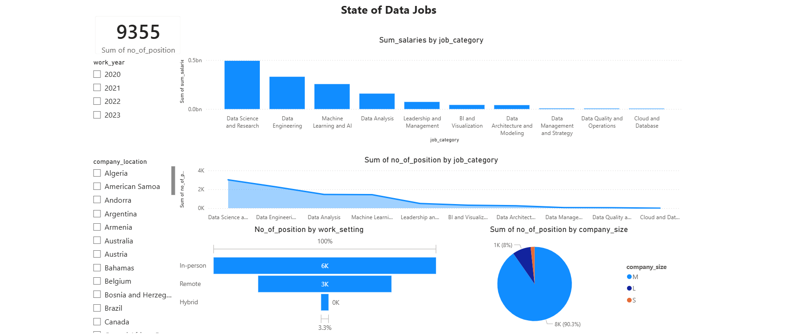

# Global Data Jobs Market Analysis (2020-2023)

## Project Overview
This project provides a comprehensive, data-driven analysis of the global data professional market from 2020 to 2023. By leveraging a dataset of over 9,300 job postings, this interactive Power BI dashboard uncovers underlying trends in skill valuation, supply vs. demand dynamics across data niches, and macroeconomic shifts in work models (remote vs. in-person).

 
*(Note: Replace `dashboard/dashboard_preview.png` with the actual path to your dashboard screenshot)*

## Dashboard Features
* **Executive KPI Cards:** Quick overview of the total job openings (**9,355**) and total salary compensation (**$1.27bn**).
* **Global Distribution Map:** A geospatial view identifying top hiring locations worldwide.
* **Demand vs. Compensation Chart:** A dual-axis line and stacked column chart comparing the volume of job openings against the average salary for each specific data niche.
* **Macro-trend Donut Charts:** Breakdown of job market shares by Company Size (Small, Medium, Large) and Work Setting (Remote, Hybrid, In-person).
* **Interactive Slicers:** Dynamic filtering capabilities by `work_year` and `company_location`.

## Tech Stack
* **Data Visualization:** Power BI
* **Data Transformation:** Power Query, DAX (Data Analysis Expressions)

## Key Insights & Business Findings

1. **Data Science & Research is the Market Leader:** Dominating both in the number of open positions (**3,014 openings**) and total salary compensation. This is the most competitive yet highly rewarded sector in the data industry.
2. **High Demand, Low Supply in ML & AI:** Machine Learning & AI ranks 3rd in average salary but only 4th in job openings. This indicates a talent shortage—companies are willing to pay a premium, but the supply of qualified professionals has not caught up.
3. **Mid-size Companies (Size M) Drive the Job Market:** Accounting for a massive **90.3%** of total job postings (~8,000/9,355 positions), while Large enterprises (Size L) contribute only 8%. 👉 *Takeaway: Job seekers should prioritize mid-sized companies and scale-ups for higher employment opportunities.*
4. **"Return-to-Office" Prevails over Remote Work:** Although Remote work is fairly common (**32.35%**), In-person roles still dominate the landscape at **64.38%**. Interestingly, the Hybrid model is practically non-existent in data roles, making up only 3.27%.
5. **Skill Valuation Polarization (BI vs. Data Architecture):**
   * **BI & Visualization:** Shows lower salaries and fewer openings, suggesting a potential market saturation for basic reporting roles.
   * **Data Architecture:** Exhibits a low volume of job openings but top-tier average salaries, highlighting the scarcity and high-level expertise required for architectural design.

## Repository Structure
```text
data-jobs-market-analysis/
│
├── data/
│   └── data_jobs_1.csv            # Raw dataset
│
├── dashboard/
│   ├── data_jobs_dashboard.pbix   # Power BI Dashboard file
│   └── dashboard_preview.png      # Screenshot of the dashboard
│
├── scripts/
│   └── data_exploration.sql
│ 
└── README.md                      # Project documentation
